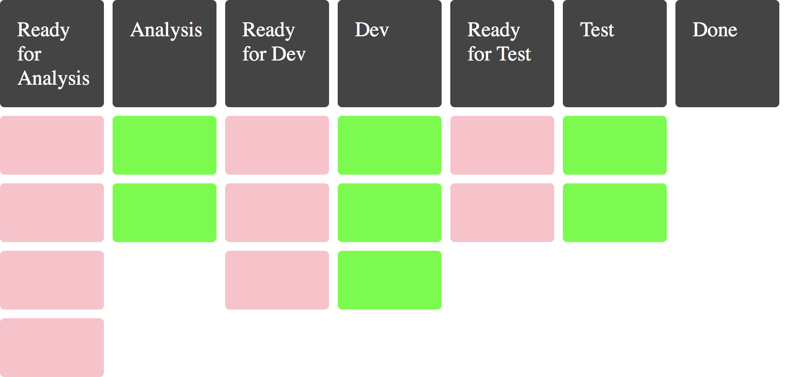
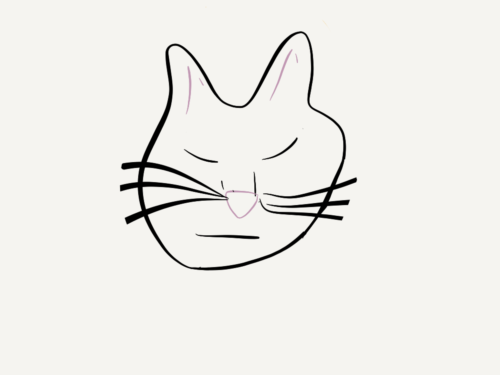
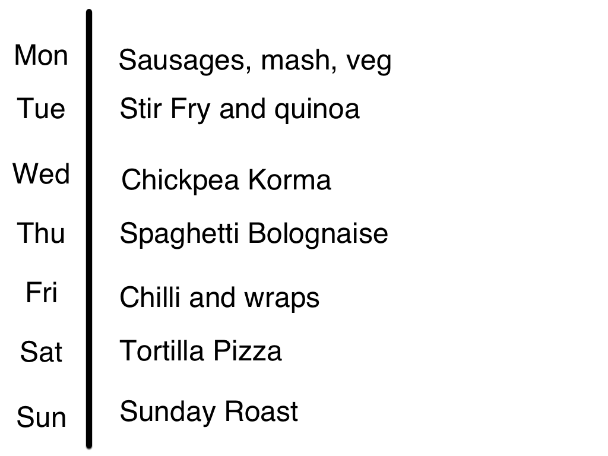
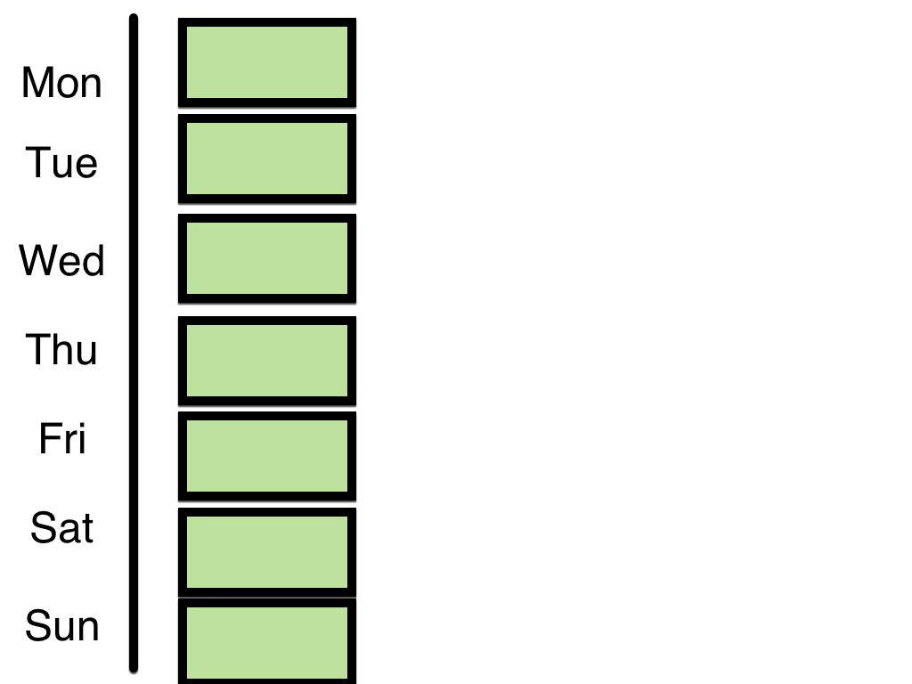
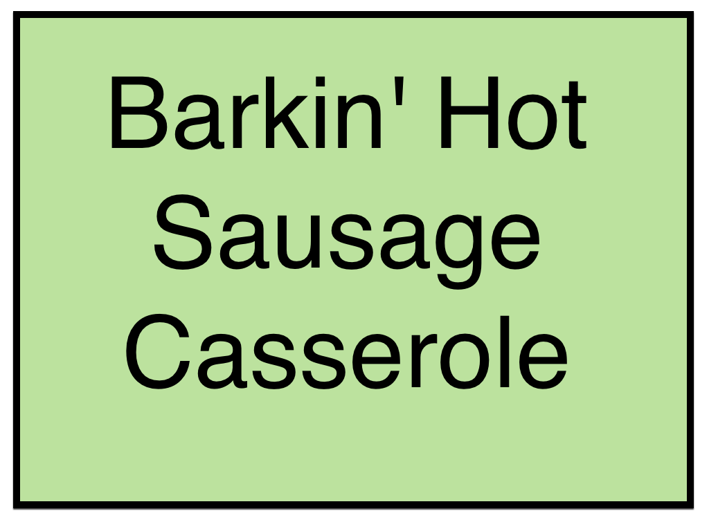
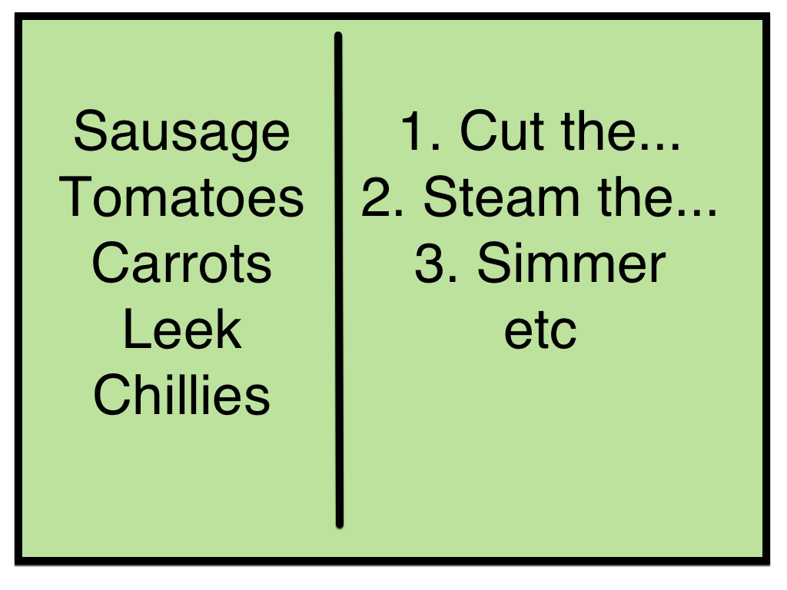
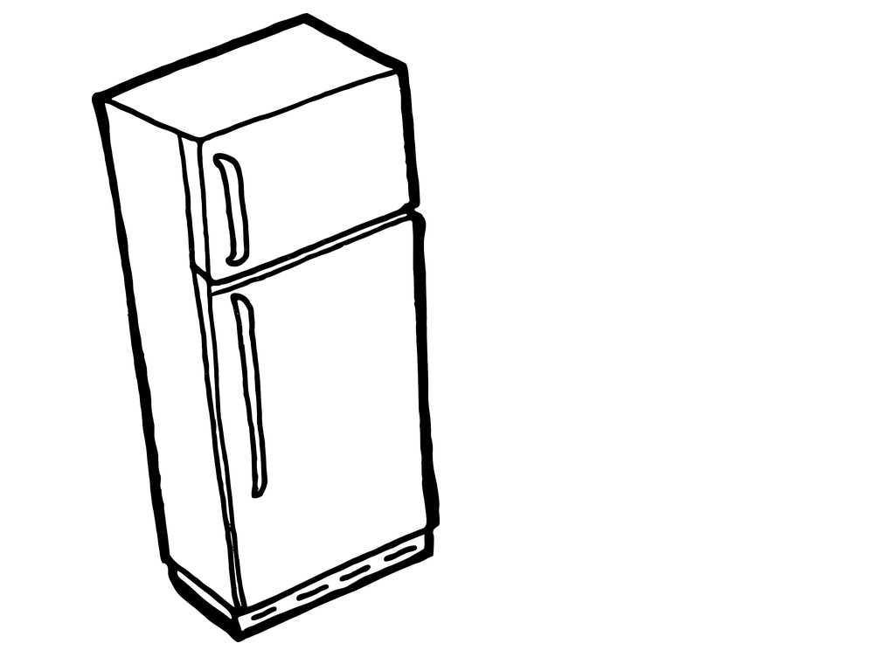
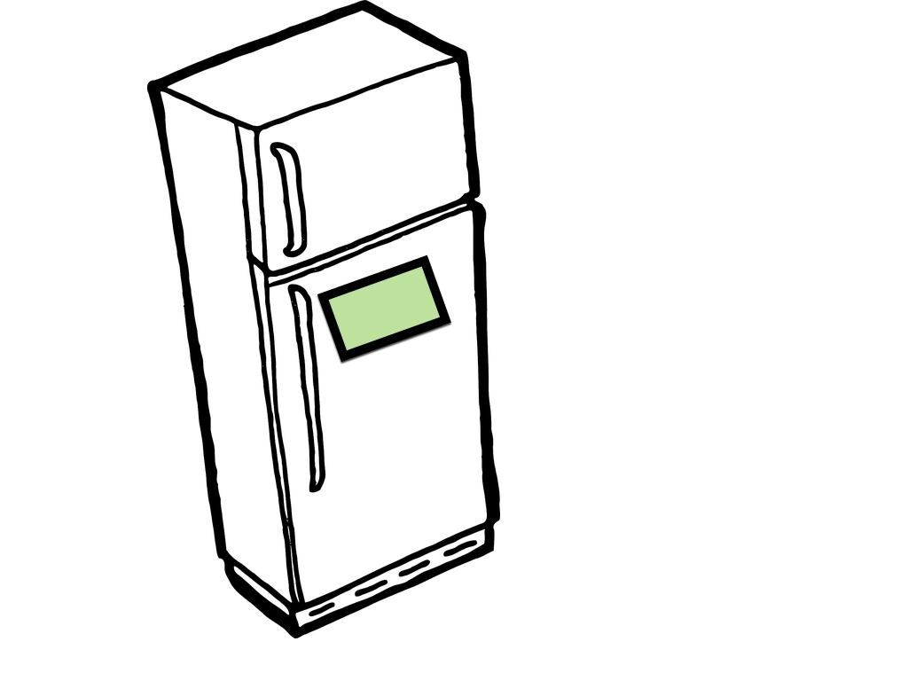
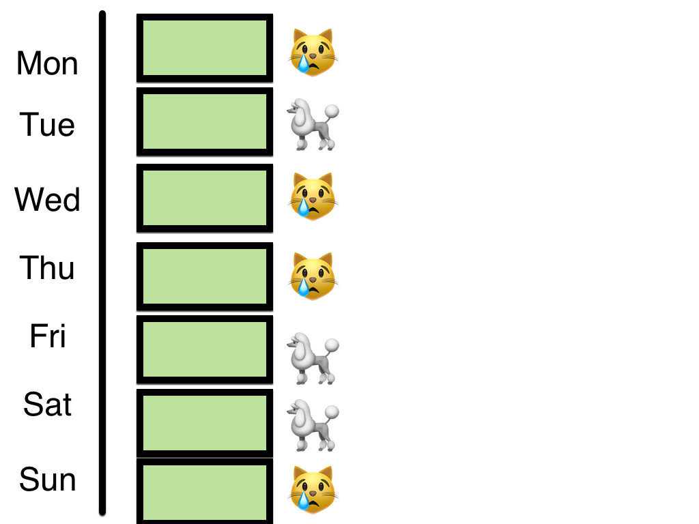
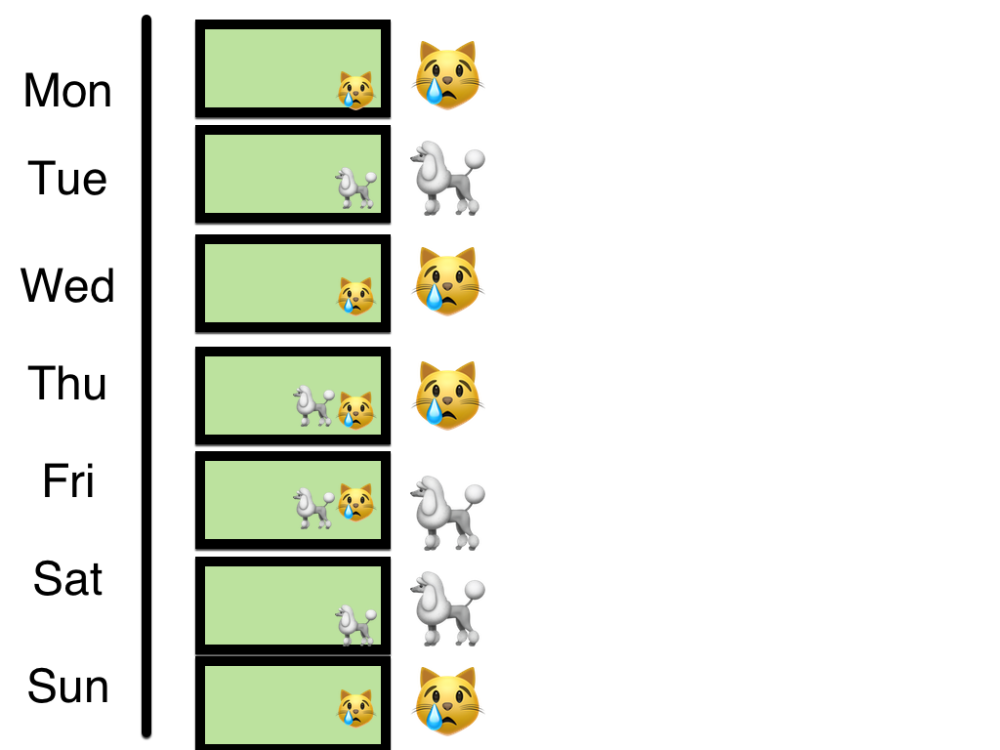

theme: Poster, 2

[.header: #FFF]

# Kitchen Kanban: A Fable

^ My name is... I am a..

---

[.background-color: #000]

## A Fable

^ Talk tonight isn't about software crafting or being lean and agile; it's about cooking, kinda.
I'm going to tell you a fable, so there's two things you should know about fables before we get started.

---

## Thing The First: Not about Software

## 💻☁️

^ The first thing: I read a lot of fables as research for this talk and surprisingly few mention software engineering or management processes. I know that this might come as a shock, but the only one that even hints at being agile is the Tortoise and the Hare. So I'm going to ask you to reflect on how a few things in the fable might be applied to what we do.

---

## Try To Consider How We are Going To

- Visualise
- Inspect
- Adapt

^ In particular, I'm going to ask you to think about visualisation, inspection, adaptation; terms that will hopefully be familiar for those in the lean/agile world, but I'll give you a very quick summary

---

# Visualisation

^ When we talk about visualisation, we mean any form of physical or graphical representation of information. That might be a kanban board showing the flow of work for a team, or it might be a burn down chart trying to convey information about progress.
TODO more visualisation. Dashboards, burndown charts, waste snakes etc

---

[.header: #FFF]

# Inspection

^ Take time to consider what you've done. Check that items of work meet your needs and whatever criteria you've set up to evaluate them.
Where do we do this in Agile? Lots of different points, including...

---

[.header: #FFF, alignment(right)]

# Adaptation

^ Change. Having considered what could be changed, consider how you will change. What possibilities are there for improvement?

---

[.build-lists: true]

# Inspect and Adapt

* Retrospective
* Sprint Review
* Daily Scrum

^ Think about all the places you might inspect and adapt in an agile process.
(go into each)

---

## Thing The Second: Animals

## 🐢🐇

^ Okay, if the lack of a software focus in fables was the first thing I wanted you to know, the second thing is that they almost all feature animals as the main characters. So, I'd like to introduce you to our heroes

---

## Koda + Oscar

^ The dog.

---

## The Story Begins... With Food

^ Koda and Oscar, having just finished another adventure, are getting hungry. When they look in their fridge, they realise they don't really have anything with which they could make a meal. In fact, they realise that they rarely do. You see, when they go for their weekly food shopping, they walk around the aisles and pick up items that look good. They sometimes know one or two meals that they'll make at some point during the week, but never them all.
That tends to mean that, after a hard day at work, they come home and take the easy option: something quick and unhealthy, often takeaway.
Of the food they did buy at the start of the week, a decent amount (around a third) gets wasted and thrown away.
Koda suggests to Oscar that they can do better.

---

# The First Board

^ They decide to come up with a plan: a board. They start by writing down each day of the week down the side of a little whiteboard. Next to each day, they write down what they're going to have on to eat in big writing. Just for the week ahead, and no further. It takes some time to come up with their 7 days of meals but they're happy with the results. Once they're done, Koda asks Oscar what ingredients they'll need for each recipe, and adds them to the shopping list. They buy just enough to make those meals and no more.
Now, when they come home from work, the board tells them in BIG letters what they're having that day. There's no thinking needed, so they get on with the task. Immediately, they see a reduction in waste and they're eating way healthier.

---

# Variation

^ After a few weeks, they're still happy with the results. Less is being wasted.
However, small changes like going out with friends unexpectedly, are causing waste. They're buying food for every day, so every day that changes is a day of waste. Their system is rigid and inflexible. It doesn't deal with the unexpected very well.

---

# Variation

^ Oscar notices that some of their meals, like Koda's Barkingly Hot Sausage Casserole, can be frozen without any ill effect. So, for some of their meals they decide to make double portions and freeze half. Not so much that it'll go bad. By including frozen meals and freezable meals in their planning, they introduce some slack: if something comes up one night, they just don't unfreeze the frozen meal and move the remaining meals around as necessary. They can deal with small amounts of change, without any big burden.

---

# Recipes

^ Another few weeks go by, and they have noticed that it takes a long to come up with the list of meals, and then even longer to turn that list into the list of ingredients they need. Rather than trying to come up with every single thing off the top of their head, Koda thinks it might be easier if they write down some recipes that they can reuse; especially for things they've done before.

---

# Recipes Board

^ So they stopped writing meals down on the whiteboard and shifted to index cards.

---

# Recipes: front

^ The front of the index cards has the same signal they needed before: big clearly written letters indicating what they meal should be.

---

# Recipes

^ The back of the index cards were split in two: one half had the list of ingredients required, the other half had the basics of the method required to cook the meal.
Suddenly, it was much easier to build the plan: they'd pull just enough recipe cards from their pile to fill the board.
It was also much easier to build the list: they'd flip those cards over and write down the recipes.
Everything got a lot better.

---

# Out of Sight

^ A few more weeks later, they've realised a small flaw in their frozen meal plan: the frozen food is out of sight. Frozen meals were being forgotten about at planning time. Worse, sometimes they ended up making a meal that they already had in the freezer. The freezer itself was a big black box into which food went, but it was hard to remember what was in there.

---

# Out of Sight

^ Oscar decided to visualise. The new rule was that when a meal was cooked and some went in the freezer, the card would be moved over and stuck to the freezer itself. Now this formerly inert store would radiate useful planning information right when it was needed.

---

# Who is cooking?

^ Recipe board was fine for what... but now who TODO fill this in

---

# Who is cooking?

^ So they made little avatars of themselves and put it to next to the stuff they'd make.
Didn't have to be themselves...
Oscar, went for a sad cat, because secretly he was lazy... like a cat.
Koda went for a poodle, because she wanted a fancy haircut

---

# Who is cooking?

^ They realised that they couldn't both make every dish. No Cat could make the Barkin' Hot Sausage Casserole!
So they put little stickers on each recipe to say who could make it. Helped balance things out better.
You could see it as representing capabilities.

---

# What else?

* Different colour cards...
* Stickies for mix-ins
* ...

^ They could keep changing it and keep modifying it to suit their unique needs.
THey could use diferrent colour cards

---

# All of It.

^ Now, I could go on about how Oscar and Koda continued to improve this system as their lives changed, but I think you get the point. Note, though, that we started talking about mostly individual ingredients being wasted. Small parts. Improvements, however, were made end-to-end where they were needed: from the initial planning, to the recipes, to cooking, and even storage. The whole system can be understood and thus changed, if you start to visualise, inspect and adapt.

---

## Again

- Visualise
- Inspect
- Adapt

---

# Further Reading

- [Personal Kanban](http://www.personalkanban.com/) by Jim Benson & Tonianne DeMaria Barry
- [The Goal](https://www.toc-goldratt.com/en/product/The-Goal-A-Process-of-Ongoing-Improvement) by Eliyahu M. Goldratt
- [Aesop's Fables](https://en.wikipedia.org/wiki/Aesop%27s_Fables) by Aesop

---

# Thank You

## In memory, Oscar 2001-2019
